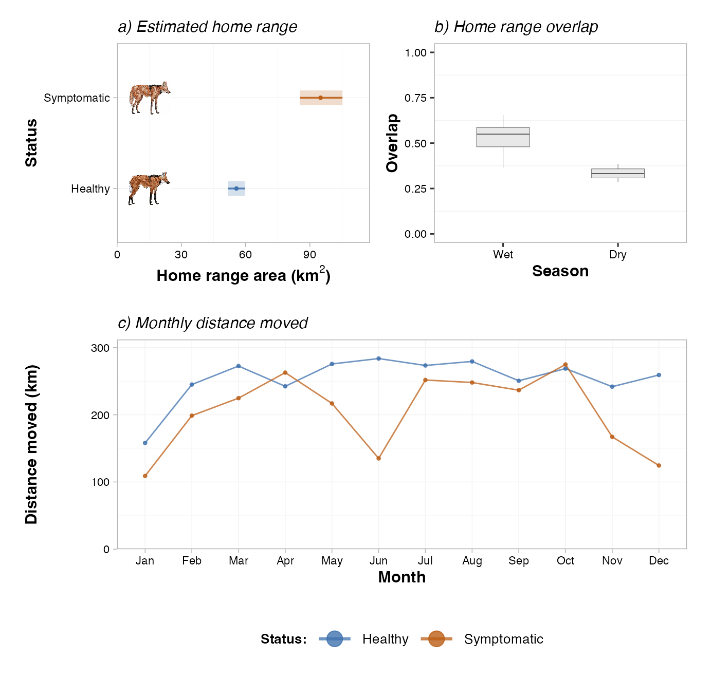
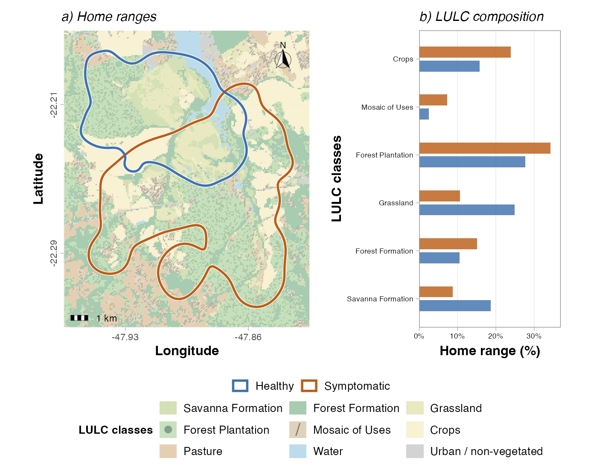
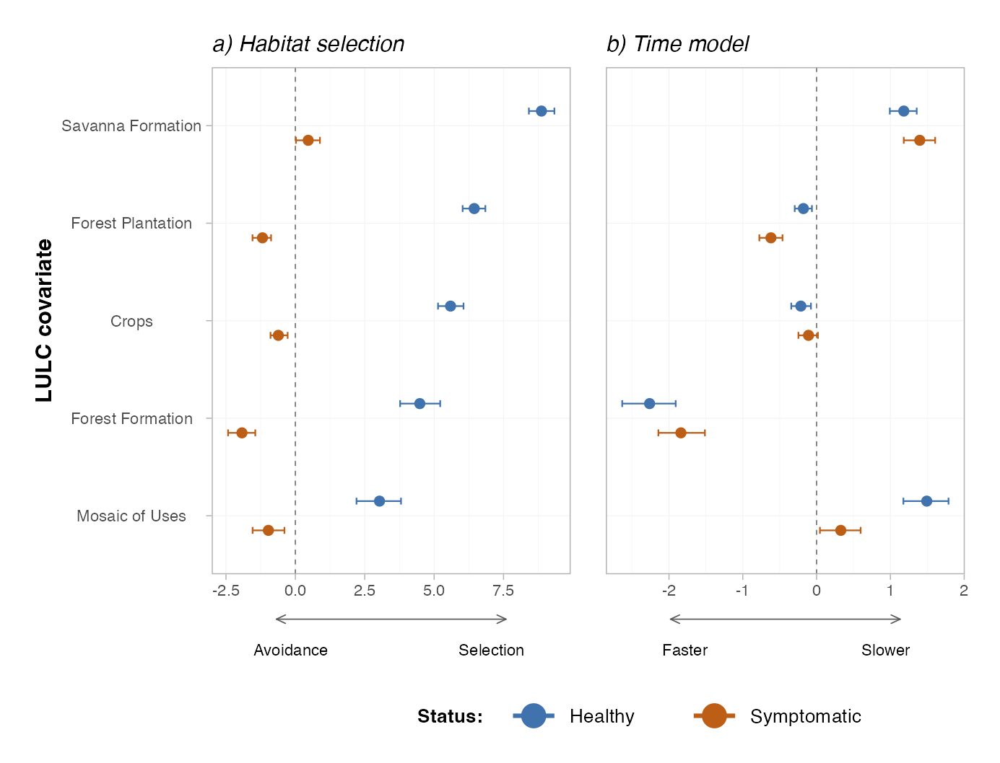

```{r setup-code-display}
library(htmltools)
library(knitr)

show_code_step <- function(path, start, end, label = NULL) {
  if (!file.exists(path)) {
    cat(sprintf("> File not found: `%s`\n", path))
    return(invisible(NULL))
  }

  lines <- readr::read_lines(path)
  start <- max(1, start)
  end <- min(length(lines), end)

  if (is.null(label)) {
    label <- sprintf("%s (lines %s-%s)", basename(path), start, end)
  }

  cat(
    "<details class='script-block'><summary><code>",
    htmlEscape(label),
    "</code></summary>\n\n```r\n",
    paste(lines[start:end], collapse = "\n"),
    "\n```\n\n</details>\n",
    sep = ""
  )
}

```

## Note {.unnumbered}

This document includes the code used to conduct the analyses and is intended to support inspection of the analytical workflow. The workflow follows this order:

1. **GPS data cleaning and processing with `ctmm`**
2. **Home range estimation and home range overlap**
3. **Time-Explicit Habitat Selection (TEHS) model**, including data preparation and model fitting
4. **References**

::: {.callout-note}
## How to read this workflow {.unnumbered}

Each stage below is written as a short explanation followed by the corresponding code block for that specific task. You can see chunks of code by clicking on the little arrows you will find throughout the document.

Whenever a script depends on accessory functions or external model files, these are shown immediately after the main workflow step that calls them so the analytical logic can be followed in sequence.
:::

## GPS data cleaning and processing

The workflow begins with the `gps_maned_wolf.rds` dataset stored in `data/raw/`. The GPS collar data are from the two focal females used in the manuscript. In this section, we reformat the coordinates and timestamps, convert the data into a telemetry object, remove outliers, and export the processed GPS table used in the remaining analyses.

### Data cleaning and processed GPS export

The complete cleaning script below reads the GPS data, standardizes the variables required by `ctmm`, applies the outlier-removal function, trims residual problematic fixes, and exports the processed GPS data used throughout the study.

```{r display-data-cleaning, results='asis'}
show_code_step(
  "01_data_cleaning.R",
  1,
  93,
  "01_data_cleaning.R: complete data cleaning workflow"
)
```

### Accessory function for outlier removal

The cleaning script depends on an accessory function that applies the same distance and speed checks to each individual.

This helper receives the telemetry objects, flags relocations that exceed the expected thresholds, and returns the cleaned `move2` objects that are immediately reused by the main cleaning script.

```{r display-outlier-removal-function, results='asis'}
show_code_step(
  "accessory_functions/01_function_ctmm_remove_outliers.R",
  1,
  38,
  "01_function_ctmm_remove_outliers.R: helper function used in GPS cleaning"
)
```

## Home range estimation and overlap

This section begins with the cleaned GPS dataset produced in stage 1. Using this file, we classified locations into wet and dry seasons, estimated annual utilization distributions, and quantified spatial overlap between individuals.

### Home range models

The complete script below reads the cleaned GPS dataset, assigns the season-year combination for São Paulo state (Wet and Dry), and runs the `ctmm` workflow for each period. The outputs are the seasonal telemetry objects, fitted movement models, and AKDE estimates used in the overlap calculations.

```{r display-home-range-models, results='asis'}
show_code_step(
  "02_home_range_function_ctmm.R",
  1,
  32,
  "02_home_range_function_ctmm.R: complete seasonal home range workflow"
)
```

### Accessory functions used for home range outputs

The home range script depends on an accessory function that executes the `ctmm` workflow period by period.

This accessory function loops over animal and period combinations, fits the movement model, computes AKDE home ranges, and writes the outputs that are later read by the overlap and plotting scripts.

```{r display-seasonal-home-range-function, results='asis'}
show_code_step(
  "accessory_functions/02_function_ctmm_seasonal.R",
  1,
  83,
  "02_function_ctmm_seasonal.R: helper functions for period-level ctmm analyses"
)
```

### Home range overlap

Once the home range outputs exist, overlap can be computed directly from the saved AKDE estimates.

The script reads the saved AKDE objects for each period, calculates overlap metrics and their confidence intervals, and writes one consolidated table.

```{r display-home-range-overlap, results='asis'}
show_code_step(
  "03_overlap_ctmm.R",
  1,
  80,
  "03_overlap_ctmm.R: complete home range overlap workflow"
)
```

Home-range estimates, seasonal overlap, and monthly distance moved for the two focal females are summarized in @fig-home-range-summary. Their annual home-range map and the associated land-cover composition are presented in @fig-home-range-map.

```{r}
#| label: fig-home-range-summary
#| echo: false
#| fig-cap: "Home-range area, overlap, and monthly distance moved for the two focal females."
#| out-width: "100%"

```

```{r}
#| label: fig-home-range-map
#| echo: false
#| fig-cap: "Annual home ranges and land-cover composition for the two focal females."
#| out-width: "100%"

```

## Time-Explicit Habitat Selection (TEHS) model

This is the most model-intensive section of the workflow because it moves from cleaned relocation data to step construction, habitat extraction, alternative-step generation, Bayesian model fitting, and posterior consolidation.

To keep this section readable, the workflow is broken into the same order used during the analysis: first derive step-level habitat information, then prepare the objects needed by JAGS, then fit the two model components, and finally translate the posterior results into the manuscript panel.

### Extract land-cover proportions for each movement step

The TEHS section starts from the same cleaned GPS file used previously in the project, but it transforms consecutive relocations into movement steps rather than home range objects. It requires the MapBiomas LULC raster for São Paulo (2023; 10-m pixels), which is not versioned on GitHub because of its size. Before running scripts 04 and 05, download the raster from [MapBiomas](https://brasil.mapbiomas.org/en/) and save it as `data/raster/mapbiomas_10m_sp_2023-0000000000-0000000000.tif`. The complete script below then extracts MapBiomas classes for each buffered movement segment and summarizes the step-level habitat information used in the TEHS workflow.

```{r display-tehs-lulc-extraction, results='asis'}
show_code_step(
  "04_lulc_prop_TEHS.R",
  1,
  360,
  "04_lulc_prop_TEHS.R: complete step-level LULC workflow"
)
```

### Prepare TEHS inputs and alternative potential steps

Once land-cover proportions have been calculated for each step, the next script organizes the data into the structure required by the TEHS models. It defines the habitat covariates, creates the temporal variables used by JAGS, and generates the observed step together with the alternative cardinal-direction steps for each animal.

This is the transition from descriptive movement processing to model-ready data preparation. The outputs written here are the exact tables consumed by the JAGS fitting script.

```{r display-tehs-preparation, results='asis'}
show_code_step(
  "05_prep_data_to_run_TEHS.R",
  1,
  350,
  "05_prep_data_to_run_TEHS.R: complete TEHS preparation workflow"
)
```

### Run the time model and habitat selection model in JAGS

After the preparation step, the workflow has everything needed to fit the Bayesian models. The modeling script first estimates the time component for each individual, saves the posterior draws, and then uses the prepared tSSF tables together with those draws to fit the habitat-selection component.

Separating the workflow into a time model and a selection model makes the fitting sequence easier to inspect and also keeps the saved outputs clean. In the published workflow, only the posterior draws needed by the next script are retained.

```{r display-tehs-model-fitting, results='asis'}
show_code_step(
  "06_run_TEHS_models.R",
  1,
  333,
  "06_run_TEHS_models.R: complete TEHS model-fitting workflow"
)
```

### Accessory JAGS models used by TEHS

The TEHS branch depends on two accessory model files: one for the time model and one for the habitat-selection component. These are not optional implementation details; they are part of the analysis itself because they define the statistical models that generated the manuscript results.

For that reason, both files are shown directly in this book so the published workflow contains not only the R scripts that call JAGS, but also the model code that JAGS executes.

```{r display-tehs-jags-models, results='asis'}
show_code_step(
  "accessory_functions/03_resist_avg_jags.R",
  1,
  31,
  "03_resist_avg_jags.R: JAGS time model"
)

show_code_step(
  "accessory_functions/04_jags_tssf.R",
  1,
  31,
  "04_jags_tssf.R: JAGS habitat-selection model"
)
```

### Consolidate posterior outputs into model-summary tables

After model fitting, the posterior draws still need to be reorganized into tidy summaries. This script performs that conversion by reading the saved posterior samples, standardizing them into a consistent tabular structure, and exporting the resulting tables.

```{r display-tehs-posterior-summary, results='asis'}
show_code_step(
  "07_inspect_TEHS_results.R",
  1,
  169,
  "07_inspect_TEHS_results.R: complete posterior consolidation workflow"
)
```

Posterior estimates from the habitat-selection and time components of the TEHS model, shown separately for the two focal females, are summarized in @fig-tehs-results.

```{r}
#| label: fig-tehs-results
#| echo: false
#| fig-cap: "Time-Explicit Habitat Selection model results for the two focal females."
#| out-width: "100%"

```

## References

The workflow shown here relies mainly on two methodological branches: continuous-time home range estimation with `ctmm` and time-explicit habitat selection based on step-level movement covariates. Land use classifications are available on [MapBiomas](https://brasil.mapbiomas.org/en/).

1. Fleming, C. H., and J. M. Calabrese. 2025. `ctmm: Continuous-Time Movement Modeling`. R package version 1.3.0. <https://CRAN.R-project.org/package=ctmm>. DOI: <https://doi.org/10.32614/CRAN.package.ctmm>

2. Fleming, C. H., W. F. Fagan, T. Mueller, K. A. Olson, P. Leimgruber, and J. M. Calabrese. 2015. Rigorous home range estimation with movement data: a new autocorrelated kernel density estimator. *Ecology* 96:1182-1188. DOI: <https://doi.org/10.1890/14-2010.1>

3. Valle, D., Attias, N., Cullen, J. A., Hooten, M. B., Giroux, A., Oliveira-Santos, L. G. R., Desbiez, A. L. J. and Fletcher, R. J. 2024. Bridging the gap between movement data and connectivity analysis using the Time-Explicit Habitat Selection (TEHS) model. *Movement Ecology* 12:19. DOI: <https://doi.org/10.1186/s40462-024-00461-1>
